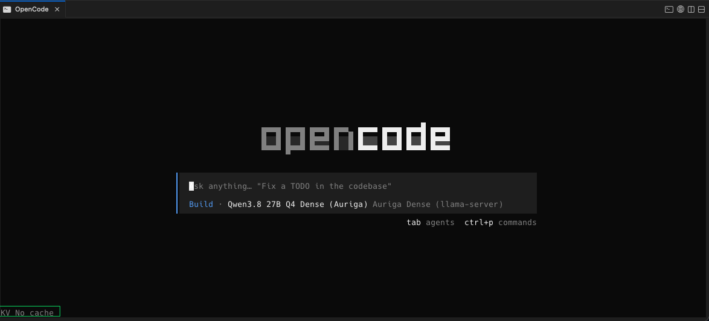
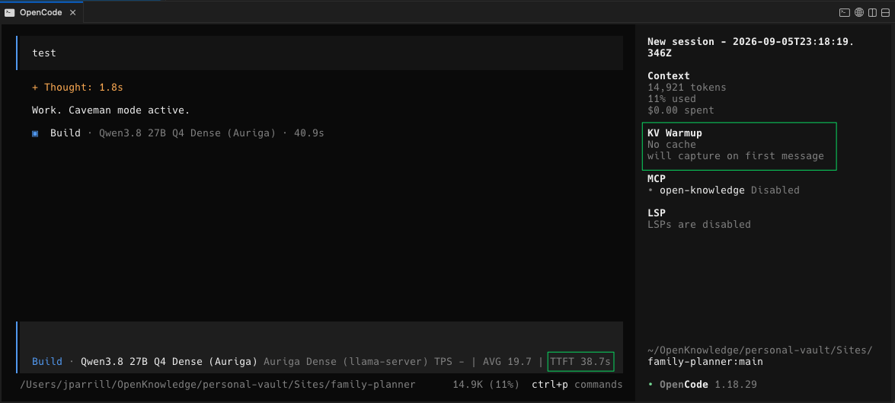
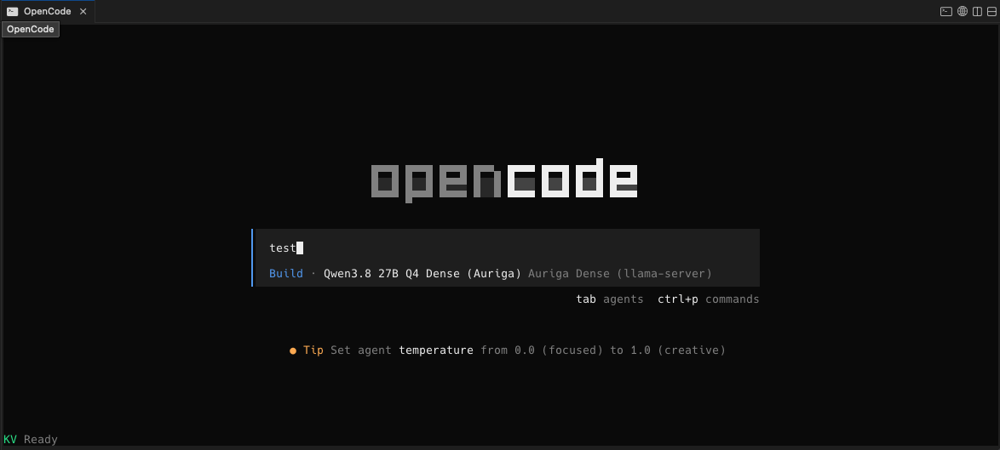
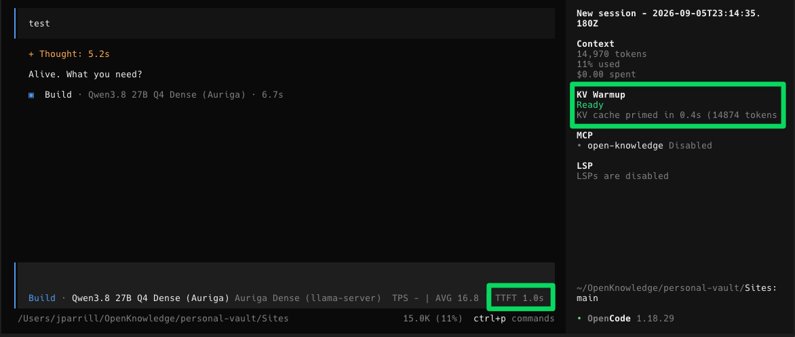

# opencode-kv-warmup

OpenCode plugin that pre-warms llama-server's KV cache at boot, reducing first-turn TTFT from ~44s to ~1s.

## Problem

When using OpenCode with a local llama-server, every new conversation pays a full prompt-processing cost on the first turn. The system prompt, tool definitions, CLAUDE.md, skills, and AGENTS.md add up to ~15K tokens. At ~340 tok/s prompt processing speed (Qwen3.8-27B dense on AMD Ryzen AI Max+ 395), that's **~44 seconds** before the model produces its first token.

Subsequent turns within the same conversation are fast (~0.5s) because llama-server's prefix cache reuses the KV state from the previous turn. But every time you open a new conversation, the full prompt is reprocessed from scratch.

## Solution

The plugin embeds a reverse proxy inside the plugin process. OpenCode sends all requests through this proxy, which:

1. **Forwards** every request to the real llama-server endpoint transparently
2. **Captures** the first large request body per session, stored per working directory
3. On next OpenCode boot, **replays** the captured request directly to llama-server with `max_tokens: 1`, filling the KV cache before the user types

Additionally, for single-slot mode (`-np 1`), the plugin redirects OpenCode's internal "small model" tasks (title generation, etc.) to a secondary MoE endpoint via the `experimental.provider.small_model` hook. This prevents title gen from evicting the warmed KV cache.

**Result: TTFT drops from ~44s to ~1s with `-np 1`.**

### Before (no cache — TTFT ~39s)





### After (cache warmed — TTFT 1.0s)





## Why a proxy is required

The proxy is not optional. No combination of OpenCode plugin hooks can produce a request body that matches what OpenCode actually sends to the API.

### The problem: exact token match

llama-server's prefix cache compares the incoming request's token sequence against what's already in a KV slot. Even a single token difference at position N invalidates everything from N onwards. That means the warmup request must be **byte-identical** to what OpenCode will send.

### What was tried (and failed)

1. **Reconstructing from hooks**: the `tool.definition` hook provides full JSON schemas (~60K chars), but OpenCode sends compact versions (~24K chars). Different tokens, no cache hit.

2. **System prompt hooks**: the `experimental.chat.system.transform` hook joins system messages into one string, but OpenCode sends them as separate messages. Different structure, different tokens.

3. **Injecting status into the system prompt**: any text added via the system transform hook changes the token sequence vs. the real request. Status must be shown in the TUI sidebar instead.

4. **Hardcoded/static warmup bodies**: the system prompt changes by directory (different CLAUDE.md, skills, env block). A static body only works for one directory and breaks on any OpenCode update.

### What works: capturing the real request

The embedded proxy intercepts the actual HTTP request that OpenCode sends. This is the **only** way to get the exact bytes that will be tokenized. The capture is stored per directory and replayed on next boot. Since the plugin adds no middleware that modifies the request, the replayed capture matches the real request exactly (LCP 0.999).

The proxy is ~50 lines of `http.createServer` with no dependencies. It runs in-process, adds no measurable latency to forwarded requests, and requires only changing `baseURL` from `http://server:8090/v1` to `http://localhost:8099/v1`.

## Prerequisites

### 1. Deterministic system prompt

For KV cache reuse across sessions, the system prompt token sequence must be identical between consecutive OpenCode launches in the same directory on the same day.

**Critical**: if skills are symlinked into multiple discovery directories (e.g., both `~/.agents/skills/` and `~/.claude/skills/`), OpenCode loads them with unbounded concurrency. Which copy "wins" for a given skill name is random per session, causing the `<location>` tag in the system prompt to flip between paths. This breaks prefix matching (~32% token drift, LCP drops from 0.999 to 0.68).

**Fix**: link each skill to exactly **one** directory (e.g., `~/.agents/skills/` only). Both Claude Code and OpenCode discover skills from `~/.agents/skills/`.

### 2. Prevent KV eviction from title generation

After the first message, OpenCode sends an internal request to generate a conversation title. This evicts the warmed KV cache, making the second turn slow again (~39s). **Without one of the following, the plugin does not work.**

Pick one:

**Option A: Two servers (recommended for `-np 1`)**

Run a secondary model (e.g., a small MoE) on a separate port and set `smallModelEndpoint` in the config. The plugin redirects title gen to the secondary server, keeping the dense server's KV cache intact.

```
Dense server (:8090) — chat only, KV cache preserved
MoE server (:8091)   — title gen, no KV conflict
```

**Option B: Two slots (`-np 2`)**

Run llama-server with `-np 2`. Title gen uses slot 1, chat stays in slot 0. No secondary server needed.

```
Slot 0 — chat (KV cache preserved)
Slot 1 — title gen (separate KV)
```

**Trade-off**: `-np 2` doubles KV cache VRAM usage. With large contexts this can be significant.

### The plugin must not modify the system prompt

Any modification to `output.system` in the `experimental.chat.system.transform` hook changes what OpenCode sends to the API, breaking the prefix match with the captured request. Warmup status is shown in the TUI sidebar panel instead.

## Architecture

```
                          OpenCode process
┌────────────────────────────────────────────────────────────┐
│                                                            │
│  baseURL: http://127.0.0.1:8099/v1                         │
│                                                            │
│  ┌──────────────────────────────────────────────────────┐  │
│  │ plugin.js                                            │  │
│  │                                                      │  │
│  │  ┌────────────────────────────────────────────────┐  │  │
│  │  │ Embedded Proxy (:8099)                         │  │  │
│  │  │                                                │  │  │
│  │  │  1. Receive request from OpenCode              │  │  │
│  │  │  2. Capture first large body per session       │  │  │
│  │  │  3. Forward to real endpoint                   │  │  │
│  │  └──────────────────┬─────────────────────────────┘  │  │
│  │                     │                                │  │
│  │  On boot:           │                                │  │
│  │    Load capture     │   Small model hook:            │  │
│  │    for cwd, replay  │     Title gen ──────────────┐  │  │
│  │    (max_tokens:1)   │                             │  │  │
│  └─────────────────────┼─────────────────────────────┼──┘  │
│                        │                             │     │
└────────────────────────┼─────────────────────────────┼─────┘
                         │                             │
              ┌──────────┘                             │
              │                                        │
              ▼                                        ▼
┌───────────────────────────┐       ┌───────────────────────────┐
│  Dense server :8090       │       │  MoE server :8091         │
│                           │       │                           │
│  - Main chat completions  │       │  - Title generation       │
│  - KV cache (single slot) │       │  - Keeps dense KV intact  │
└───────────────────────────┘       └───────────────────────────┘


                          Disk (per directory)
┌────────────────────────────────────────────────────────────┐
│                                                            │
│  ~/.config/opencode/                                       │
│  ├── kv-warmup.json              Config (hot-reloaded)     │
│  ├── .kv-warmup-status.json      State for TUI sidebar     │
│  ├── .kv-warmup-captures/                                  │
│  │   ├── a76a9c475300.json       Capture for ~/project-a   │
│  │   └── f3b21e887c04.json       Capture for ~/project-b   │
│  └── .kv-warmup-debug/           Cross-session diff dumps  │
│                                                            │
└──────────────────────────────┬─────────────────────────────┘
                               │
                               ▼
┌────────────────────────────────────────────────────────────┐
│  TUI sidebar (tui.tsx)                                     │
│                                                            │
│  Polls .kv-warmup-status.json every 1.5s                   │
│  [Ready] [Warming] [No cache] [Error] [Disabled]           │
└────────────────────────────────────────────────────────────┘
```

## Files

| File | Purpose |
|------|---------|
| `plugin.js` | Embedded proxy + warmup on boot + small model redirect |
| `tui.tsx` | TUI sidebar panel: shows warmup state with colored indicators |
| `test/plugin.test.js` | Unit tests for core functions and proxy forwarding |
| `package.json` | Package metadata |
| `Makefile` | `make test`, `make lint`, `make check` |

### Runtime files (in `~/.config/opencode/`)

| File | Purpose |
|------|---------|
| `kv-warmup.json` | Plugin config (hot-reloaded on every request) |
| `.kv-warmup-captures/<hash>.json` | Per-directory captured request bodies |
| `.kv-warmup-debug/<hash>_<ts>.json` | Debug dumps for cross-session diff analysis |
| `.kv-warmup-status.json` | Current warmup state (read by TUI) |

## Setup

### 1. Register the plugin

In `~/.config/opencode/opencode.json`:

```json
{
  "provider": {
    "your-provider": {
      "options": {
        "baseURL": "http://127.0.0.1:8099/v1"
      }
    }
  },
  "plugin": [
    "/path/to/opencode-kv-warmup/plugin.js"
  ]
}
```

Note: `baseURL` points to the proxy, not the real server.

### 2. Create plugin config

```bash
cat > ~/.config/opencode/kv-warmup.json << 'EOF'
{
  "enabled": true,
  "endpoint": "http://your-llama-server:8090",
  "proxyPort": 8099,
  "smallModelEndpoint": "http://your-llama-server:8091/v1"
}
EOF
```

- `endpoint`: real llama-server URL (proxy forwards here)
- `proxyPort`: local proxy port (must match baseURL in opencode.json)
- `smallModelEndpoint`: secondary server for title gen (prevents KV eviction)

### 3. Ensure deterministic skills

Link each skill to **one** discovery directory only:

```bash
# Good: one destination
DESTS=("$HOME/.agents/skills")

# Bad: duplicates cause non-deterministic <location> tags
DESTS=("$HOME/.agents/skills" "$HOME/.claude/skills")
```

### 4. First run (bootstrap)

On first boot in a directory, no captured request exists. Send any message — the proxy captures the request body. The first message processes from scratch (~44s). On the **second** boot in that directory, the warmup replays that capture.

**Important**: if you change the skill setup (add/remove skills, fix duplicate symlinks, etc.), you must purge stale captures. Otherwise the warmup will prime the KV cache with outdated tokens that don't match the current system prompt:

```bash
rm ~/.config/opencode/.kv-warmup-captures/*.json
```

Or set `"clearCache": true` in `kv-warmup.json` to clear the capture for the current directory only.

### 5. Verify

The warmup runs in the background when OpenCode starts. The home screen footer shows `KV Warming...` during warmup and `KV Ready` when done. To verify:

1. Start OpenCode and wait for the footer to show `KV Ready`
2. Send any message — TTFT should be ~1s instead of ~39s
3. The sidebar will show `Ready` with warmup timing details

Alternatively, check llama-server logs for `LCP similarity` — values above 0.95 confirm prefix cache hit. You can also inspect the status file directly:

```bash
cat ~/.config/opencode/.kv-warmup-status.json
```

### Hot-reload controls

Edit `kv-warmup.json` while OpenCode is running (changes apply on next request):

- `"enabled": false` — proxy becomes transparent passthrough, no capture or warmup on restart
- `"clearCache": true` — deletes capture for current directory, auto-resets to false

## Measured results

| Metric | Before | After |
|--------|--------|-------|
| Turn 1 TTFT | ~44s | ~1s |
| LCP similarity | 0.68 (non-deterministic skills) | 0.999 |
| Tokens reprocessed | 14,879 (all) | 13 (user message only) |
| Warmup time (background) | — | ~44s |

Hardware: AMD Ryzen AI Max+ 395, 128GB unified RAM, Qwen3.8-27B-UD-Q4_K_XL.gguf
